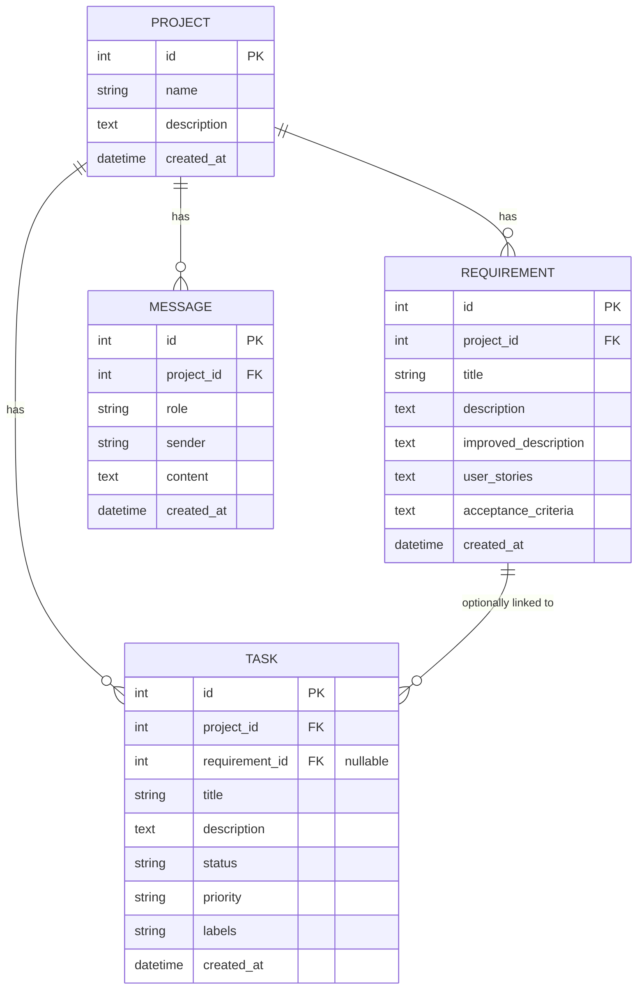
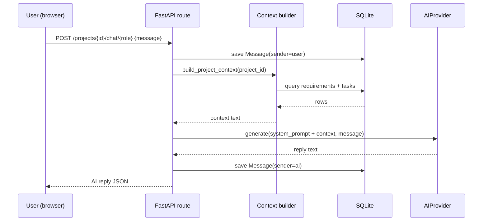

# Architecture Document
## AI Studio for Software Engineering — Prototype

Companion to `SRS.md`. Describes how the system is actually built, not the
target production architecture — the gap between the two is mapped in §8.

---

## 1. Goals and Constraints

**Goals:** prove the "shared project context feeds multiple specialized AI
assistants" mechanic with real, runnable code; keep the whole thing runnable
with two commands and no external services; make the AI backend swappable
without touching endpoint code.

**Constraints:** single user, single process, local-only. No requirement to
support concurrent writers, multiple tenants, or production-grade uptime in
this version.

---

## 2. Architectural Style

**Layered modular monolith**, single FastAPI process:

```
┌─────────────────────────────────────────┐
│  Frontend (static HTML/JS, in-browser)   │
└───────────────────┬───────────────────────┘
                     │ fetch() / JSON over HTTP
┌───────────────────▼───────────────────────┐
│  FastAPI app (main.py)                     │
│  ┌───────────────────────────────────────┐ │
│  │ Route handlers (projects/reqs/tasks/   │ │
│  │ chat) — thin, validate + call context  │ │
│  │ builder + provider                     │ │
│  └───────────────┬───────────────────────┘ │
│  ┌───────────────▼───────────────────────┐ │
│  │ build_project_context() +              │ │
│  │ ask_assistant() — the shared-context    │ │
│  │ mechanic, the one piece every assistant │ │
│  │ route funnels through                   │ │
│  └───────────────┬───────────────────────┘ │
│  ┌───────────────▼───────────────────────┐ │
│  │ AIProvider (ai_provider.py)             │ │
│  │  MockProvider | AnthropicProvider       │ │
│  └───────────────────────────────────────┘ │
│  ┌───────────────────────────────────────┐ │
│  │ SQLAlchemy models + session (SQLite)   │ │
│  └───────────────────────────────────────┘ │
└─────────────────────────────────────────────┘
```

There is deliberately no service layer / repository layer / DTO-mapper
separation (Clean Architecture style) yet — with four entities and a dozen
endpoints, that indirection wasn't earning its cost. Section 8 flags where
to introduce it as the system grows.

---

## 3. Component Responsibilities

| Component | File | Responsibility |
|---|---|---|
| Route handlers | `main.py` | HTTP-level validation (Pydantic models), calling into the DB session and, for AI endpoints, `ask_assistant()` |
| Context builder | `main.py: build_project_context()` | Assembles one project's requirements + tasks into a single text block — the *only* thing that defines what an assistant "knows" |
| Assistant dispatch | `main.py: ask_assistant()` | Looks up the assistant's system prompt, appends the context, calls the provider |
| Assistant registry | `main.py: ASSISTANTS` | Single source of truth for the four roles' names and system prompts |
| Provider abstraction | `ai_provider.py: AIProvider` | Abstract `generate(system_prompt, user_prompt) -> str` |
| Mock provider | `ai_provider.py: MockProvider` | Deterministic templated text, zero external calls |
| Real provider | `ai_provider.py: AnthropicProvider` | Wraps the `anthropic` SDK's `messages.create` |
| Provider selection | `ai_provider.py: get_provider()` | Picks Anthropic if `ANTHROPIC_API_KEY` is set and the SDK is installed, else Mock |
| Data models | `main.py` (SQLAlchemy) | `Project`, `Requirement`, `Task`, `Message` |
| Frontend (prototype) | `prototype/frontend/index.html` | Tabs for Requirements / Kanban / Documents / Chat |
| Frontend (MVP) | `frontend/` (Vite + React) | Production SPA shell |

---

## 4. Data Model



No formal migrations exist — schema is created via
`Base.metadata.create_all()` on startup. See §8 for the Postgres/Flyway
migration path.

---

## 5. Key Request Flow: Chat with an Assistant



The same flow (context build → provider call) is reused, unmodified, by the
three requirement AI actions (`improve`, `user-stories`,
`acceptance-criteria`) — they just pass a different `user_prompt` and always
target the `business_analyst` role.

---

## 6. AI Provider Abstraction — Design Rationale

The interface is intentionally one method wide:

```python
class AIProvider(ABC):
    def generate(self, system_prompt: str, user_prompt: str) -> str: ...
```

This is narrower than what the full vision calls for (a "Prompt Manager,"
"Conversation Manager," "AI Service Layer" as separate components). That
richness was deferred because with a single synchronous call per request and
no conversation memory yet, those layers would currently just pass values
through unchanged. Introduce them when one of the following becomes true:
multiple prompt *templates* per assistant (not just one fixed system
prompt), multi-turn context assembly beyond "latest requirements+tasks," or
support for streaming/tool-use responses.

---

## 7. Current Deployment View

```
Developer's machine
├── backend/  → `uvicorn main:app --port 8000`  (one process)
│   └── ai_studio.db  (SQLite file, created on first run)
└── frontend/index.html  → opened directly in a browser
```

No containers, no reverse proxy, no process manager, no environment beyond
`ANTHROPIC_API_KEY` (optional). This is appropriate for local evaluation
only — see §8 for what a real deployment needs.

---

## 8. Migration Path to the Full Production Architecture

This maps each gap to a concrete architectural change, ordered the same way
as the README's "what to extend first."

1. **Validate the core mechanic with real AI** — no architecture change,
   just set `ANTHROPIC_API_KEY`. Do this before investing in anything below.

2. **Conversation memory** — extend `build_project_context()` (or split it)
   to also include the last N `Message` rows for that project+role, so a
   chat thread has continuity. Still no new component needed.

3. **RAG over source code** — introduces a new component: a document/embedding
   store (start with Chroma or pgvector) plus an ingestion pipeline for
   uploaded code/docs. `AIProvider.generate()` stays the same; a new
   `ContextBuilder` step retrieves relevant chunks and appends them before
   the call. This is the first point where a distinct "Context Builder"
   component (as named in the full vision) actually earns its keep.

4. **Auth (JWT) + RBAC** — add a `User` entity, an auth middleware/dependency
   in FastAPI, and scope every query by `owner_id` / project membership.
   This is also the natural point to introduce a service layer between
   routes and models, since authorization checks shouldn't live in route
   handlers directly.

5. **Postgres + Flyway** — swap the SQLAlchemy engine URL and add a
   migrations directory; do this *after* step 4, once the schema has
   actually changed from real usage, to avoid migrating a schema that's
   still moving.

6. **React/TypeScript frontend** — replace `frontend/index.html` once the UI
   interaction patterns (what the Kanban board needs beyond a status
   dropdown, what the chat UI needs beyond a scrollback list) are proven
   out cheaply in the current version.

7. **Docker + Nginx + CI/CD** — containerize backend + frontend build,
   add a reverse proxy, wire up GitHub Actions for test+build+deploy.
   Last, because none of it changes whether the product idea works — it's
   pure hardening once the idea is validated.

8. **Security hardening** — rate limiting, input sanitization beyond
   framework defaults, audit logging, secure file upload — layer these in
   alongside step 4, since most of them only matter once the app is
   multi-user and reachable over a network.
