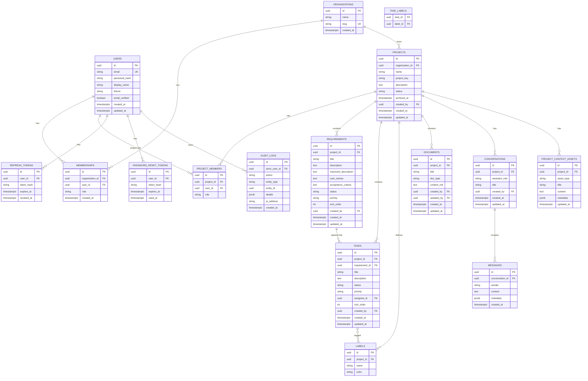

# Database Design
## AI Studio for Software Engineering — MVP

| Field | Value |
|---|---|
| **DBMS** | PostgreSQL 16+ |
| **Migrations** | Flyway |
| **ID strategy** | UUID (`gen_random_uuid()`) |
| **Timestamps** | `TIMESTAMPTZ`, UTC |

---

## 1. Design Principles

1. **Normalized** to 3NF for transactional entities; denormalized counters only where justified (dashboard can aggregate).
2. **Multi-tenant via organizations** — all projects belong to an org; users access via membership.
3. **Soft archive** for projects (`archived_at`); hard delete deferred or admin-only.
4. **AI artifacts** stored as columns or child rows (stories/AC as text/jsonb for MVP simplicity).
5. **Audit trail** append-only.
6. **Indexes** on FKs and common filters (`org_id`, `project_id`, `status`).

---

## 2. ER Diagram



---

## 3. Enumerations

| Enum | Values |
|---|---|
| `org_role` | `OWNER`, `ADMIN`, `MEMBER`, `VIEWER` |
| `project_role` | `OWNER`, `ADMIN`, `MEMBER`, `VIEWER` |
| `project_status` | `ACTIVE`, `ARCHIVED` |
| `requirement_status` | `DRAFT`, `READY`, `IN_PROGRESS`, `DONE`, `DEPRECATED` |
| `priority` | `LOW`, `MEDIUM`, `HIGH`, `CRITICAL` |
| `task_status` | `TODO`, `IN_PROGRESS`, `REVIEW`, `DONE` |
| `doc_type` | `README`, `API_DOC`, `RELEASE_NOTES`, `TECH_DOC`, `OTHER` |
| `assistant_role` | `BUSINESS_ANALYST`, `DEVELOPER`, `QA_ENGINEER`, `DOCUMENTATION_WRITER` |
| `message_sender` | `USER`, `ASSISTANT`, `SYSTEM` |
| `context_asset_type` | `DATABASE_DESIGN`, `API_SPEC`, `SOURCE_METADATA`, `OTHER` |

Store as `VARCHAR` with CHECK constraints (portable, readable) or PostgreSQL `ENUM` types. MVP recommendation: **VARCHAR + CHECK**.

---

## 4. SQL Schema (Baseline)

```sql
-- V1__init_schema.sql (excerpt — full migration in §6)

CREATE EXTENSION IF NOT EXISTS pgcrypto;

CREATE TABLE users (
    id              UUID PRIMARY KEY DEFAULT gen_random_uuid(),
    email           VARCHAR(320) NOT NULL,
    password_hash   VARCHAR(255) NOT NULL,
    display_name    VARCHAR(120) NOT NULL,
    theme           VARCHAR(20) NOT NULL DEFAULT 'SYSTEM',
    email_verified  BOOLEAN NOT NULL DEFAULT FALSE,
    created_at      TIMESTAMPTZ NOT NULL DEFAULT NOW(),
    updated_at      TIMESTAMPTZ NOT NULL DEFAULT NOW(),
    CONSTRAINT uq_users_email UNIQUE (email),
    CONSTRAINT ck_users_theme CHECK (theme IN ('LIGHT', 'DARK', 'SYSTEM'))
);

CREATE TABLE organizations (
    id          UUID PRIMARY KEY DEFAULT gen_random_uuid(),
    name        VARCHAR(200) NOT NULL,
    slug        VARCHAR(100) NOT NULL,
    created_at  TIMESTAMPTZ NOT NULL DEFAULT NOW(),
    CONSTRAINT uq_organizations_slug UNIQUE (slug)
);

CREATE TABLE memberships (
    id               UUID PRIMARY KEY DEFAULT gen_random_uuid(),
    organization_id  UUID NOT NULL REFERENCES organizations(id) ON DELETE CASCADE,
    user_id          UUID NOT NULL REFERENCES users(id) ON DELETE CASCADE,
    role             VARCHAR(20) NOT NULL,
    created_at       TIMESTAMPTZ NOT NULL DEFAULT NOW(),
    CONSTRAINT uq_membership UNIQUE (organization_id, user_id),
    CONSTRAINT ck_membership_role CHECK (role IN ('OWNER','ADMIN','MEMBER','VIEWER'))
);

CREATE TABLE projects (
    id                UUID PRIMARY KEY DEFAULT gen_random_uuid(),
    organization_id   UUID NOT NULL REFERENCES organizations(id) ON DELETE CASCADE,
    name              VARCHAR(200) NOT NULL,
    project_key       VARCHAR(10) NOT NULL,
    description       TEXT,
    status            VARCHAR(20) NOT NULL DEFAULT 'ACTIVE',
    archived_at       TIMESTAMPTZ,
    created_by        UUID REFERENCES users(id),
    created_at        TIMESTAMPTZ NOT NULL DEFAULT NOW(),
    updated_at        TIMESTAMPTZ NOT NULL DEFAULT NOW(),
    CONSTRAINT uq_project_org_key UNIQUE (organization_id, project_key),
    CONSTRAINT ck_project_status CHECK (status IN ('ACTIVE','ARCHIVED'))
);

CREATE TABLE project_members (
    id          UUID PRIMARY KEY DEFAULT gen_random_uuid(),
    project_id  UUID NOT NULL REFERENCES projects(id) ON DELETE CASCADE,
    user_id     UUID NOT NULL REFERENCES users(id) ON DELETE CASCADE,
    role        VARCHAR(20) NOT NULL,
    CONSTRAINT uq_project_member UNIQUE (project_id, user_id),
    CONSTRAINT ck_project_member_role CHECK (role IN ('OWNER','ADMIN','MEMBER','VIEWER'))
);

CREATE TABLE requirements (
    id                     UUID PRIMARY KEY DEFAULT gen_random_uuid(),
    project_id             UUID NOT NULL REFERENCES projects(id) ON DELETE CASCADE,
    title                  VARCHAR(300) NOT NULL,
    description            TEXT NOT NULL DEFAULT '',
    improved_description   TEXT,
    user_stories           TEXT,
    acceptance_criteria    TEXT,
    status                 VARCHAR(20) NOT NULL DEFAULT 'DRAFT',
    priority               VARCHAR(20) NOT NULL DEFAULT 'MEDIUM',
    sort_order             INT NOT NULL DEFAULT 0,
    created_by             UUID REFERENCES users(id),
    created_at             TIMESTAMPTZ NOT NULL DEFAULT NOW(),
    updated_at             TIMESTAMPTZ NOT NULL DEFAULT NOW(),
    CONSTRAINT ck_req_status CHECK (status IN ('DRAFT','READY','IN_PROGRESS','DONE','DEPRECATED')),
    CONSTRAINT ck_req_priority CHECK (priority IN ('LOW','MEDIUM','HIGH','CRITICAL'))
);

CREATE TABLE tasks (
    id               UUID PRIMARY KEY DEFAULT gen_random_uuid(),
    project_id       UUID NOT NULL REFERENCES projects(id) ON DELETE CASCADE,
    requirement_id   UUID REFERENCES requirements(id) ON DELETE SET NULL,
    title            VARCHAR(300) NOT NULL,
    description      TEXT,
    status           VARCHAR(20) NOT NULL DEFAULT 'TODO',
    priority         VARCHAR(20) NOT NULL DEFAULT 'MEDIUM',
    assignee_id      UUID REFERENCES users(id) ON DELETE SET NULL,
    sort_order       INT NOT NULL DEFAULT 0,
    created_by       UUID REFERENCES users(id),
    created_at       TIMESTAMPTZ NOT NULL DEFAULT NOW(),
    updated_at       TIMESTAMPTZ NOT NULL DEFAULT NOW(),
    CONSTRAINT ck_task_status CHECK (status IN ('TODO','IN_PROGRESS','REVIEW','DONE')),
    CONSTRAINT ck_task_priority CHECK (priority IN ('LOW','MEDIUM','HIGH','CRITICAL'))
);

CREATE TABLE labels (
    id          UUID PRIMARY KEY DEFAULT gen_random_uuid(),
    project_id  UUID NOT NULL REFERENCES projects(id) ON DELETE CASCADE,
    name        VARCHAR(60) NOT NULL,
    color       VARCHAR(7) NOT NULL DEFAULT '#6B7280',
    CONSTRAINT uq_label_project_name UNIQUE (project_id, name)
);

CREATE TABLE task_labels (
    task_id   UUID NOT NULL REFERENCES tasks(id) ON DELETE CASCADE,
    label_id  UUID NOT NULL REFERENCES labels(id) ON DELETE CASCADE,
    PRIMARY KEY (task_id, label_id)
);

CREATE TABLE documents (
    id           UUID PRIMARY KEY DEFAULT gen_random_uuid(),
    project_id   UUID NOT NULL REFERENCES projects(id) ON DELETE CASCADE,
    title        VARCHAR(300) NOT NULL,
    doc_type     VARCHAR(30) NOT NULL DEFAULT 'OTHER',
    content_md   TEXT NOT NULL DEFAULT '',
    created_by   UUID REFERENCES users(id),
    updated_by   UUID REFERENCES users(id),
    created_at   TIMESTAMPTZ NOT NULL DEFAULT NOW(),
    updated_at   TIMESTAMPTZ NOT NULL DEFAULT NOW(),
    CONSTRAINT ck_doc_type CHECK (doc_type IN ('README','API_DOC','RELEASE_NOTES','TECH_DOC','OTHER'))
);

CREATE TABLE conversations (
    id              UUID PRIMARY KEY DEFAULT gen_random_uuid(),
    project_id      UUID NOT NULL REFERENCES projects(id) ON DELETE CASCADE,
    assistant_role  VARCHAR(40) NOT NULL,
    title           VARCHAR(200),
    created_by      UUID REFERENCES users(id),
    created_at      TIMESTAMPTZ NOT NULL DEFAULT NOW(),
    updated_at      TIMESTAMPTZ NOT NULL DEFAULT NOW(),
    CONSTRAINT ck_assistant_role CHECK (assistant_role IN (
        'BUSINESS_ANALYST','DEVELOPER','QA_ENGINEER','DOCUMENTATION_WRITER'
    )),
    CONSTRAINT uq_conversation_project_role UNIQUE (project_id, assistant_role)
);

CREATE TABLE messages (
    id               UUID PRIMARY KEY DEFAULT gen_random_uuid(),
    conversation_id  UUID NOT NULL REFERENCES conversations(id) ON DELETE CASCADE,
    sender           VARCHAR(20) NOT NULL,
    content          TEXT NOT NULL,
    metadata         JSONB NOT NULL DEFAULT '{}'::jsonb,
    created_at       TIMESTAMPTZ NOT NULL DEFAULT NOW(),
    CONSTRAINT ck_message_sender CHECK (sender IN ('USER','ASSISTANT','SYSTEM'))
);

CREATE TABLE project_context_assets (
    id           UUID PRIMARY KEY DEFAULT gen_random_uuid(),
    project_id   UUID NOT NULL REFERENCES projects(id) ON DELETE CASCADE,
    asset_type   VARCHAR(40) NOT NULL,
    title        VARCHAR(200) NOT NULL,
    content      TEXT NOT NULL DEFAULT '',
    metadata     JSONB NOT NULL DEFAULT '{}'::jsonb,
    updated_at   TIMESTAMPTZ NOT NULL DEFAULT NOW(),
    CONSTRAINT ck_asset_type CHECK (asset_type IN (
        'DATABASE_DESIGN','API_SPEC','SOURCE_METADATA','OTHER'
    ))
);

CREATE TABLE refresh_tokens (
    id           UUID PRIMARY KEY DEFAULT gen_random_uuid(),
    user_id      UUID NOT NULL REFERENCES users(id) ON DELETE CASCADE,
    token_hash   VARCHAR(128) NOT NULL,
    expires_at   TIMESTAMPTZ NOT NULL,
    revoked_at   TIMESTAMPTZ,
    created_at   TIMESTAMPTZ NOT NULL DEFAULT NOW(),
    CONSTRAINT uq_refresh_token_hash UNIQUE (token_hash)
);

CREATE TABLE password_reset_tokens (
    id           UUID PRIMARY KEY DEFAULT gen_random_uuid(),
    user_id      UUID NOT NULL REFERENCES users(id) ON DELETE CASCADE,
    token_hash   VARCHAR(128) NOT NULL,
    expires_at   TIMESTAMPTZ NOT NULL,
    used_at      TIMESTAMPTZ,
    created_at   TIMESTAMPTZ NOT NULL DEFAULT NOW(),
    CONSTRAINT uq_password_reset_hash UNIQUE (token_hash)
);

CREATE TABLE audit_logs (
    id             UUID PRIMARY KEY DEFAULT gen_random_uuid(),
    actor_user_id  UUID REFERENCES users(id) ON DELETE SET NULL,
    action         VARCHAR(80) NOT NULL,
    entity_type    VARCHAR(80),
    entity_id      UUID,
    details        JSONB NOT NULL DEFAULT '{}'::jsonb,
    ip_address     VARCHAR(45),
    created_at     TIMESTAMPTZ NOT NULL DEFAULT NOW()
);
```

### Indexes

```sql
CREATE INDEX idx_memberships_user ON memberships(user_id);
CREATE INDEX idx_projects_org ON projects(organization_id);
CREATE INDEX idx_projects_status ON projects(organization_id, status);
CREATE INDEX idx_project_members_user ON project_members(user_id);
CREATE INDEX idx_requirements_project ON requirements(project_id);
CREATE INDEX idx_tasks_project_status ON tasks(project_id, status);
CREATE INDEX idx_tasks_requirement ON tasks(requirement_id);
CREATE INDEX idx_documents_project ON documents(project_id);
CREATE INDEX idx_messages_conversation ON messages(conversation_id, created_at);
CREATE INDEX idx_context_assets_project ON project_context_assets(project_id, asset_type);
CREATE INDEX idx_audit_created ON audit_logs(created_at);
CREATE INDEX idx_refresh_user ON refresh_tokens(user_id);
```

---

## 5. Notes on Key Design Choices

### Conversations
MVP uses **one conversation per (project, assistant_role)** so history is shared for the project. Multi-thread chats are Phase 2 (drop unique constraint, add `thread` concept).

### User stories & AC
Stored as `TEXT` (markdown) on `requirements` for speed of MVP. Normalize to child tables later if filtering/querying individual stories is required.

### Context assets
Holds DB design, API specs, and source metadata so the context builder can include them without inventing separate modules yet.

### Tokens
Store only **hashes** of refresh/reset tokens.

---

## 6. Flyway Migration Plan

| Version | File | Purpose |
|---|---|---|
| V1 | `V1__init_schema.sql` | All tables + indexes above |
| V2 | `V2__seed_assistant_metadata.sql` | Optional reference table for assistant catalog (or keep in code) |
| V3 | `V3__add_file_attachments.sql` | Future uploads table |

Canonical migration artifact (also copy into the Spring app when implementing):

```
docs/sql/V1__init_schema.sql
→ backend/src/main/resources/db/migration/V1__init_schema.sql
```

### Flyway config (Spring)

```yaml
spring:
  flyway:
    enabled: true
    locations: classpath:db/migration
    baseline-on-migrate: true
```

---

## 7. Sample Seed (Dev Only)

Not applied in production migrations. Use `data.sql` profile or Testcontainers fixtures:

- User: `demo@aistudio.local` / `ChangeMe123!`
- Org: `Demo Workspace`
- Project: `DEMO` — sample requirements + tasks

---

## 8. Backup & Retention (MVP Ops)

- Nightly `pg_dump` of primary database.
- Retain audit logs ≥ 90 days.
- Soft-archived projects retained indefinitely until explicit purge job (Phase 2).

---

## 9. Document Control

| Version | Date | Notes |
|---|---|---|
| 1.0 | 2026-08-06 | Initial normalized schema + Flyway plan |

**Previous:** `02-SYSTEM-ARCHITECTURE.md` · **Next:** `04-API-SPECIFICATION.md`
