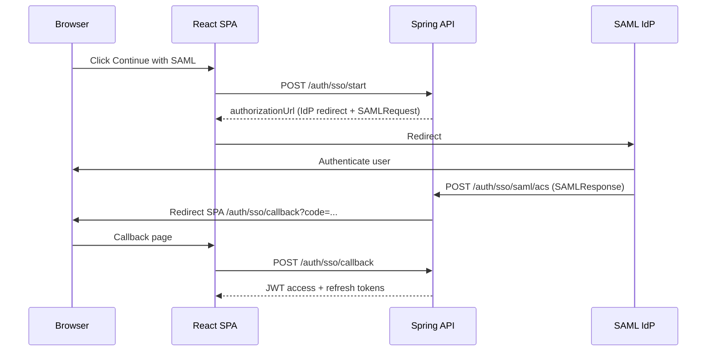

# SAML SP-initiated SSO binding

Production SAML login for enterprises that require SP-initiated flows (HTTP-Redirect `AuthnRequest` + HTTP-POST `SAMLResponse`). Complements OIDC ([15-OIDC-IDP-GUIDE.md](15-OIDC-IDP-GUIDE.md)) and the dev stub ([16-SAML-SSO-STUB.md](16-SAML-SSO-STUB.md)).

**MVP scope:** SP-initiated login, IdP metadata from URL, ACS POST endpoint, SP metadata export. Signed AuthnRequests and encrypted assertions are not required for initial IdP wiring.

---

## 1. Flow



1. Frontend calls `POST /api/v1/auth/sso/start` (same as OIDC/mock).
2. API returns an IdP redirect URL with deflated `SAMLRequest` and `RelayState` (state).
3. IdP POSTs `SAMLResponse` to **`POST /api/v1/auth/sso/saml/acs`** (configure this ACS URL on the IdP).
4. API validates the assertion, redirects the browser to the SPA callback with a one-time `code`.
5. SPA completes login via existing `POST /api/v1/auth/sso/callback`.

---

## 2. Environment variables

```bash
SSO_ENABLED=true
SSO_PROVIDER=saml
SAML_STUB_MODE=false
SSO_APP_BASE_URL=https://staging.example.com

# IdP metadata (HTTP GET URL from Okta / Entra / etc.)
SAML_METADATA_URL=https://idp.example.com/app/metadata
# SP entity ID (often your app URL or URN)
SAML_ENTITY_ID=https://staging.example.com/saml/metadata
# Where IdP POSTs SAMLResponse (API edge — nginx must proxy /api/v1)
SAML_ACS_URL=https://staging.example.com/api/v1/auth/sso/saml/acs
SAML_DISPLAY_NAME=Continue with SAML
```

Also set `CORS_ORIGINS` and `BILLING_APP_BASE_URL` to the SPA origin.

| Variable | Required (SP mode) | Purpose |
|---|---|---|
| `SAML_METADATA_URL` | Yes | IdP metadata XML URL |
| `SAML_ENTITY_ID` | Yes | SP entity ID registered at IdP |
| `SAML_ACS_URL` | Yes | Assertion consumer URL (API) |
| `SAML_STUB_MODE` | — | `false` for real SAML; `true` for dev stub |

---

## 3. IdP configuration checklist

1. **Fetch SP metadata** (register app at IdP):

   ```bash
   curl -fsS https://staging.example.com/api/v1/auth/sso/saml/metadata
   ```

2. Set **ACS URL** = `SAML_ACS_URL` (HTTP-POST binding).
3. Set **Entity ID** = `SAML_ENTITY_ID`.
4. Map attributes: **email** (NameID or `email` / `mail` attribute) and optional **displayName** / `name`.
5. Allow **SP-initiated** sign-on.

### Okta (example)

- Create SAML 2.0 app → paste SP metadata or manual ACS + entity ID.
- Single sign-on URL comes from your IdP metadata URL (`SAML_METADATA_URL`).

### Microsoft Entra ID

- Enterprise application → SAML → Identifier = `SAML_ENTITY_ID`, Reply URL = `SAML_ACS_URL`.
- Download federation metadata URL → use as `SAML_METADATA_URL`.

---

## 4. Staging validation

```bash
./scripts/validate-staging-env.sh   # requires SAML_ACS_URL when SAML_STUB_MODE=false
export IMAGE_TAG=v0.2.19-beta
./scripts/staging-ghcr-deploy.sh
```

Smoke (with real IdP): login page → SAML → dashboard. CI continues to use `SAML_STUB_MODE=true` ([16-SAML-SSO-STUB.md](16-SAML-SSO-STUB.md)).

---

## 5. Dev / CI stub

Keep `SAML_STUB_MODE=true` (default) for local docker-compose and GitHub Actions — no IdP required. See [16-SAML-SSO-STUB.md](16-SAML-SSO-STUB.md).

---

## 6. Related

| Doc | Topic |
|---|---|
| [15-OIDC-IDP-GUIDE.md](15-OIDC-IDP-GUIDE.md) | Preferred production SSO (OIDC) |
| [16-SAML-SSO-STUB.md](16-SAML-SSO-STUB.md) | Dev/CI SAML stub |
| [14-STAGING-DOGFOOD-GUIDE.md](14-STAGING-DOGFOOD-GUIDE.md) | Staging deploy |

---

## Document control

| Version | Date | Notes |
|---|---|---|
| 1.0 | 2026-08-08 | SP-initiated SAML binding + ACS + SP metadata |
